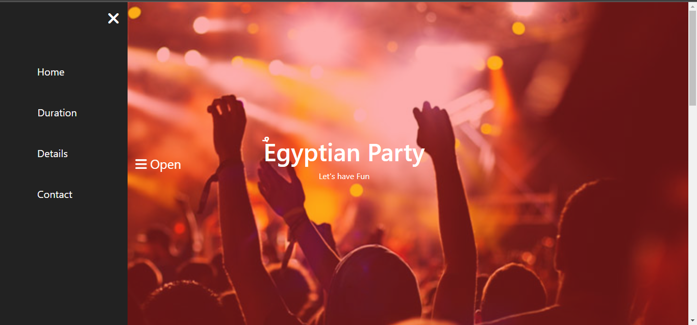
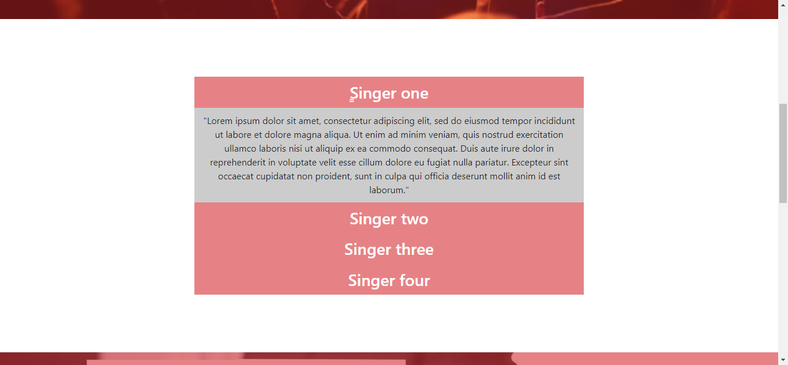
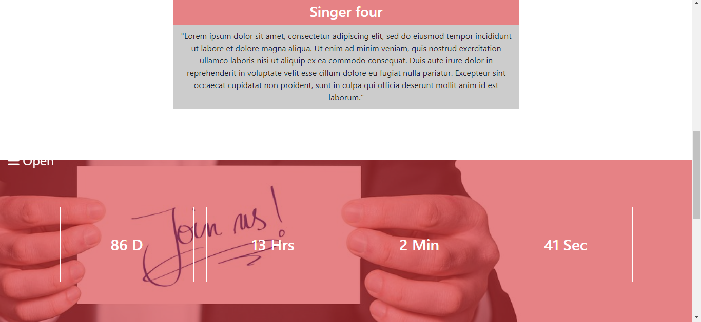
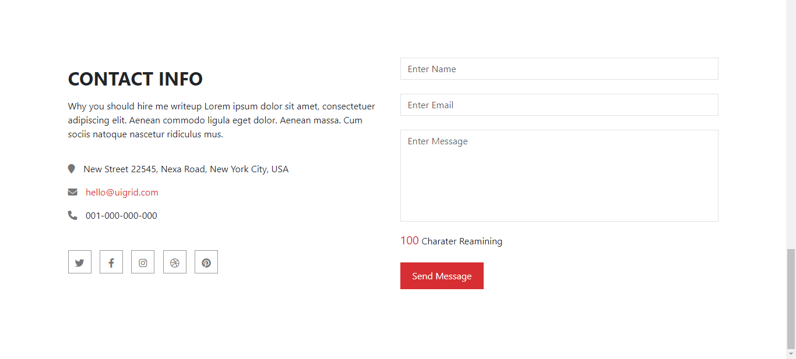

# Egyptian Party

This is a simple web application for an upcoming Egyptian party event. The website includes a side menu, a countdown feature for the event date, and a responsive design. It is built using HTML, CSS, Bootstrap, JavaScript, and jQuery.

## Features

- Side menu with open and close functionality using jQuery
- Countdown to the event date using JavaScript Date Object
- User-friendly and responsive design for all devices
- Interactive UI with smooth animations and transitions
- Event details section with dynamic updates

## Technologies Used

- HTML
- CSS 
- Bootstrap
- JavaScript 
- jQuery

## Preview

## Live Demo

Check out the live demo [here](https://mohammed-fawzzi.github.io/Egyptian-Party/).
